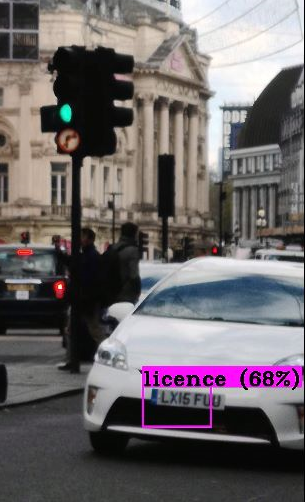
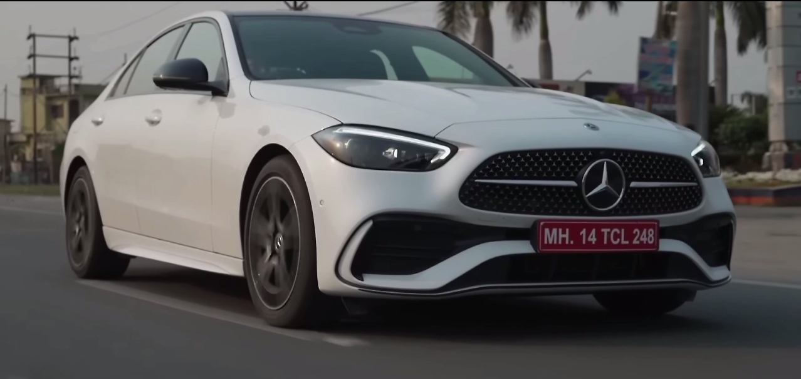
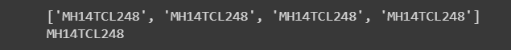

# Smart Parking Management System

The project is an example of a computer vision application of AI technology. The aim of this 
project is to automate the process of identifying and tracking vehicles in a parking lot by 
using their number plates. This system can be used to manage parking facilities at 
universities, companies, and other institutions.

The bounding box, class IDs, and confidence scores are found by using the model outputs on the input image and then Non-maximum suppression is applied to remove overlapping boxes.

The model used to detect the license plate is a custom trained yolov4 based model. the dataset used is a combimation of:-

https://www.kaggle.com/datasets/andrewmvd/car-plate-detection 

https://www.kaggle.com/datasets/saisirishan/indian-vehicle-dataset

The final dataset contains 1035 images and some copyright free videos to test the model.

the annotations were converted from pascal voc to yolov4 format t [class x_center y_center width 
height] 

after the detection of license plate the character are extracted using easyocr on the cropped image of the plate then applying some post processing the license number is generated and stored or deleted in the database.

## Demo

## Step By Step Explanation
The code uses computer vision techniques and a pre-trained deep learning model to detect license plates in a video stream and perform optical character recognition (OCR) to extract the license plate number.
The code step by step:
1.	Train your custom YOLO V4 model using darknet on custom dataset, download the generated weights and custom cfg file to run detection using this model.

2.	Import the required libraries - cv2 for computer vision tasks, numpy for numerical operations, time to measure time, os.path for file path operations, easyocr for OCR, matplotlib for visualization, and sqlite3 for database operations. If using local env install pytorch as easyocr requires it, also install CUDA if you want to use your gpu to accelerate the process.
3.	Set the configuration parameters for the deep learning model, such as the input image size (whT), the confidence threshold (confThreshold), and the non-maximum suppression threshold (nmsThreshold).
4.	Read the class names from a file (classesFile) and load the pre-trained YOLOv4 model from disk using the configuration file (modelConfiguration) and the weights file (modelWeights).
5.	Define a function findObjects that takes the YOLOv4 model outputs and the input image as inputs and uses them to extract the bounding boxes, class IDs, and confidence scores of the detected objects. Non-maximum suppression is applied to remove overlapping boxes, and the function returns the cropped license plate image.
6.	Set up a video capture object (cap) to read frames from a video file (./tvideo2.mp4).
7.	In a while loop, read a frame from the video stream and preprocess it by resizing it to the input size required by the YOLOv4 model and normalizing its pixel values.
8.	Pass the preprocessed image through the YOLOv4 model and extract the outputs.
9.	Call the findObjects function on the model outputs and input image.
10.	If the license plate is successfully detected and recognized, print the license plate number.
11.	If the license plate is not detected or recognized, continue reading the next frame until a license plate is detected and recognized or the end of the video stream is reached.
12.	Use Remove_special_charachter() to remove any special characters from the license plate number detected and save all the detected license plate number in an array.
13.	Using most_frequent_string(arr) finds the most frequently occurring number for precise detection.
14.	The detected cars details will be stored in database by use of sqlite3.
15.	The vehicles license plate and entry time will be captured at time of entry and at the time of exit exit time will be printed.
16.	Release the video capture object and close all windows
